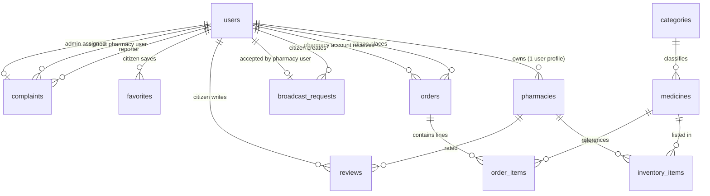

# Week 9 — Database Schema Design (MedLink)

**Course:** Parallel and Distributed Systems — Project MedLink  
**Deliverables:** (1) This report, (2) `MedLink_week9_schema_and_data.sql`

---

## 1. Purpose

Design a relational schema for **MedLink**: citizens search medicines, pharmacies hold **inventory**, citizens place **orders**, and auxiliary features include **broadcast requests**, **reviews**, **favorites**, and **complaints**. The SQL file implements the structure **aligned with the Laravel migrations** in `backend/database/migrations/` and includes **sample data** for demonstration and testing.

---

## 2. Entity–Relationship Overview (ERD)

The diagram below is a logical ERD (cardinalities described in text where the diagram is simplified).

**Cardinality notes (short):**

- One **category** has many **medicines**; each medicine belongs to one category.
- One **user** (pharmacy role) has one **pharmacies** row (business profile); each pharmacy row references exactly one `users.id`.
- **inventory_items** is a resolving table between **pharmacies** and **medicines** (many-to-many) with extra attributes (quantity, price, status). Unique `(pharmacy_id, medicine_id)` prevents duplicate stock rows.
- **orders** link a **citizen** (`citizen_id` → `users`) and a **pharmacy user** (`pharmacy_id` → `users`), matching the current Laravel migration (pharmacy account is a user).
- **order_items** normalize line-level data (medicine, quantity, unit price, subtotal) and reference `orders.id` (string PK).

---

## 3. Primary Keys (PK) and Foreign Keys (FK)

| Table | PK | Foreign keys (FK) |
|-------|----|-------------------|
| `users` | `id` | — |
| `categories` | `id` | — |
| `medicines` | `id` | `category_id` → `categories.id` (ON DELETE CASCADE) |
| `pharmacies` | `id` | `user_id` → `users.id` (CASCADE) |
| `inventory_items` | `id` | `pharmacy_id` → `pharmacies.id`; `medicine_id` → `medicines.id` (CASCADE) |
| `orders` | `id` (string) | `citizen_id` → `users.id`; `pharmacy_id` → `users.id` (CASCADE) |
| `order_items` | `id` | `order_id` → `orders.id`; `medicine_id` → `medicines.id` (CASCADE) |
| `broadcast_requests` | `id` (string) | `citizen_id` → `users.id`; `accepted_pharmacy_id` → `users.id` (SET NULL) |
| `reviews` | `id` | `citizen_id` → `users.id`; `pharmacy_id` → `pharmacies.id` (CASCADE); UNIQUE(`citizen_id`,`pharmacy_id`) |
| `favorites` | `id` (UUID char) | `citizen_id` → `users.id`; UNIQUE(`citizen_id`,`favorite_type`,`favorite_id`) |
| `complaints` | `id` (string) | `reporter_id`, `against_pharmacy_id` → `users.id`; `assigned_admin_id` → `users.id` (SET NULL) |

---

## 4. Normalization & duplication (engineering check)

**Target:** Third Normal Form (3NF) for core entities, with a few **intentional denormalizations** for application convenience.

### 4.1 Good normalization (low duplication)

- **Categories vs medicines:** Category name/description live once in `categories`; medicines store only `category_id` — avoids repeating “Antibiotics”, “Pain Relief”, etc. on every drug row (**1NF/2NF** friendly).
- **Inventory:** Stock and pharmacy-specific price are in `inventory_items`, not copied onto `medicines` — correct separation of **catalog** vs **pharmacy stock** (**3NF**).
- **Order lines:** Repeating per-medicine facts (quantity, unit price, subtotal) belong in `order_items`, not repeated columns on `orders` — classic **1:N** decomposition.

### 4.2 Intentional redundancy / trade-offs (documented)

- **`orders.medicines` (JSON):** Duplicates information that also exists in `order_items`. Typical reasons: fast read of a snapshot at order time, mobile/API convenience, or legacy field. **Engineering note:** For strict normalization, rely on `order_items` only and drop or deprecate `medicines` JSON; if kept, application logic should treat `order_items` as **source of truth** for totals and inventory.
- **`favorites.favorite_data` (JSON):** Optional snapshot of name/price so the UI still works if catalog rows change — duplicates catalog data by design (cache/snapshot pattern).
- **`pharmacies.rating` and `review_count`:** Can be derived from `reviews`; storing them duplicates aggregates unless maintained by triggers/jobs (**denormalization for read performance**).
- **`broadcast_requests.medicine_name`:** Free text when the medicine may not exist in `medicines` — avoids forcing a FK to `medicines` for “unknown” requests; acceptable domain trade-off.

### 4.3 Linking “tasks” to users (assignment analogy)

Orders and broadcast requests are the main **workflow** objects: they are **linked to users** via `citizen_id` and `pharmacy_id` (and optional `accepted_pharmacy_id`), satisfying the requirement that work items tie back to responsible accounts.

---

## 5. How to use the `.sql` file

1. Open MySQL 8+ (CLI, MySQL Workbench, or phpMyAdmin).
2. (Optional) Uncomment and run the `CREATE DATABASE` / `USE` lines at the top of `MedLink_week9_schema_and_data.sql` to load into a separate schema.
3. Execute the full script. It **drops** existing tables with the same names (disable or rename if you already use these names in production).
4. Sample logins use Laravel’s default bcrypt string for password **`password`** (same hash as in Laravel factories: `$2y$10$92IXUNpkjO0rOQ5byMi.Ye4oKoEa3Ro9llC/.og/at2.uheWG/igi`).

**File path:** `docs/week9/MedLink_week9_schema_and_data.sql`

---

## 6. Traceability to the codebase

The SQL schema is derived from the project’s Laravel migrations under:

`backend/database/migrations/`

If the team later changes migrations, update this Week 9 SQL and report together so coursework and repository stay aligned.

---

## 7. Summary

- **ERD → SQL:** All core MedLink tables, PKs, and FKs are implemented in one script with **referential integrity** (InnoDB).
- **Normalization:** Catalog and inventory are normalized; JSON/snapshot fields are **conscious denormalization** with rationale above.
- **Deliverables:** `MedLink_week9_schema_and_data.sql` + this `Week9_Report.md` in `docs/week9/`.
